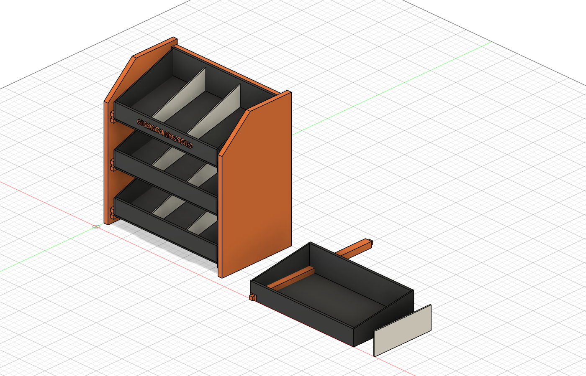

# BINSTACK — настольный органайзер электронщика

**GIVANTA MASTERS** · мебель для тех, кто делает вещи руками

Трёхъярусный настольный минишкафчик с наклонными открытыми лотками: винтики,
флюсы, припой, провода, термоусадка — всё видно и всё на расстоянии пальцев.
Спроектирован в Fusion 360. **Две версии в одном репозитории**: из фанеры
12 мм и полностью печатная на 3D-принтере (детали до 250×250×250 мм).

---

## Кому и зачем

Рабочее место электронщика: паяешь, собираешь макетки, прошиваешь
микроконтроллеры. Каждый ярус наклонён на 12° — содержимое сползает к
переднему бортику, откуда его удобно брать. Перегородки делят ярус на три
отсека: крепёж / химия и припой / провода. Верх — полочка под мультиметр.

## Версия из фанеры

Габарит 420 × 240 × 390 мм, берёзовая фанера 12 мм + ХДФ 6 мм.

| | |
|---|---|
|  |  |

- Косые боковины, три наклонных лотка с бортиками 48 мм
- 9 отсеков (перегородки переставные), полочка сверху
- Оранжевые маркировочные планки на бортиках — печать PETG
- Сборка на шканты 6×30 и клей ПВА, ~1 час
- Карта раскроя: [docs/cutlist.csv](docs/cutlist.csv)

**Чертёж** (SVG также в [docs/drawings](docs/drawings)):

## Печатная версия BINSTACK P

Для тех, у кого есть 3D-принтер и нет циркулярки. Все детали помещаются на
стол 250×250×250, печать **без поддержек**, комплект ~750 г PETG.

| | |
|---|---|
|  |  |

Конструкция: две боковины-лесенки с интегрированными полозьями под 12°,
лотки задвигаются как ящики, две штанги с шипами стягивают каркас.

| Файл | Деталь | Кол-во | Ориентация печати |
|---|---|---|---|
| [print/bp-side-panel.stl](print/bp-side-panel.stl) | боковина с полозьями, 240×150×8 | 2 (одна зеркально) | плашмя, полозьями вверх |
| [print/bp-bin.stl](print/bp-bin.stl) | лоток 201×117×45 | 3 | дном вниз |
| [print/bp-stretcher.stl](print/bp-stretcher.stl) | штанга с шипами, 224 мм | 2 | лёжа |
| [print/bp-divider.stl](print/bp-divider.stl) | перегородка | 6 | плашмя |

Режим: PETG, сопло 0,4, слой 0,2, заполнение 15 %, стенки 3 периметра.
Посадки: паз полоза 3,2 мм под дно 2,4 (зазор 0,4 на сторону), шипы штанг
6×6 в карманы 7×7. Зеркальную боковину слайсер делает функцией Mirror.

Печатные планки фанерной версии: [print/label-strip-340mm.stl](print/label-strip-340mm.stl).

## CAD

- [cad/binstack-full.step](cad/binstack-full.step) — фанерная версия, полная сборка
- [cad/binstack-print-full.step](cad/binstack-print-full.step) — печатная версия + отдельные детали

## Серия GIVANTA MASTERS

- [WORKSHOP ONE](https://github.com/studygeorge/givanta-workshop-one) — верстак инженера + башня 3D-принтера

## Лицензия

CC BY 4.0 — стройте, печатайте, дорабатывайте. Указывайте авторство:
**GIVANTA MASTERS**.

---

*GIVANTA MASTERS · 2026*
