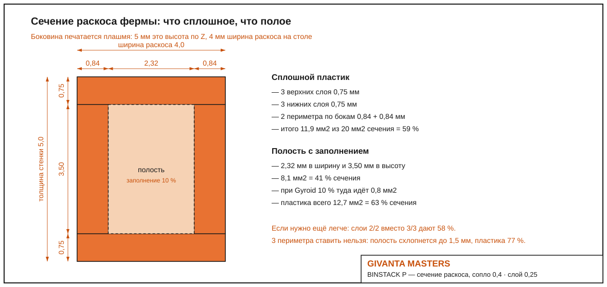

# BINSTACK — настольный органайзер электронщика

**GIVANTA MASTERS** · мебель для тех, кто делает вещи руками

Трёхъярусный настольный минишкафчик с наклонными открытыми лотками: винтики,
флюсы, припой, провода, термоусадка — всё видно и всё на расстоянии пальцев.
Спроектирован в Fusion 360. **Две версии в одном репозитории**: из фанеры
12 мм и полностью печатная на 3D-принтере (детали до 250×250×250 мм).

---

## Кому и зачем

Рабочее место электронщика: паяешь, собираешь макетки, прошиваешь
микроконтроллеры. Каждый ярус наклонён на 12° — содержимое сползает к
переднему бортику, откуда его удобно брать. Перегородки делят ярус на три
отсека: крепёж / химия и припой / провода. Верх — полочка под мультиметр.

## Версия из фанеры

Габарит 420 × 240 × 390 мм, берёзовая фанера 12 мм + ХДФ 6 мм.

| | |
|---|---|
|  |  |

- Косые боковины, три наклонных лотка с бортиками 48 мм
- 9 отсеков (перегородки переставные), полочка сверху
- Оранжевые маркировочные планки на бортиках — печать PETG
- Сборка на шканты 6×30 и клей ПВА, ~1 час
- Карта раскроя: [docs/cutlist.csv](docs/cutlist.csv)

**Чертёж** (SVG также в [docs/drawings](docs/drawings)):

## Печатная версия BINSTACK P

Для тех, у кого есть 3D-принтер и нет циркулярки. Все детали помещаются на
стол 250×250×250, печать **без поддержек**, комплект ~445 г PETG
(боковины облегчены фермой, см. ниже).

| | |
|---|---|
|  |  |

Конструкция: две боковины-лесенки с интегрированными полозьями под 12°,
лотки задвигаются как ящики, две штанги стягивают каркас.

**На чём лоток ездит:**
- **Дно лотка шире корпуса на 6 мм с каждой стороны.** Эти выступающие
  фланцы и есть салазки: они лежат в пазу между верхним и нижним полозом
  боковины (перекрытие 5,5 мм). Паз 3,2 мм, дно 2,4 мм — зазор 0,4 на
  сторону по нашей базе печати. Больше в конструкции ничего не требуется:
  ни направляющих, ни метизов.
- Наклон 12° работает на удержание: сам лоток внутрь не сползает, а ход
  назад ограничен задними штангами.

**На чём держатся перегородки:**
На передней и задней стенке лотка напечатаны пары рёбер, образующие
вертикальный паз 3,2 мм. Перегородка (2,4 мм) вставляется в него сверху,
стоит на дне и торцами упирается в стенки: вбок не ездит, не падает,
вынимается вверх пальцами. Пазов **5 на лоток** (шаг 33 мм), так что
перегородки переставляются под размер того, что в них лежит: от одного
широкого отсека до шести узких (перегородки докупать не нужно, просто
напечатать ещё — деталь одна и та же).
- **Детент-упор** — главное, что держит лоток от произвольного выезда. На
  переднем конце каждого нижнего полоза напечатан бугорок 1,0 мм с пологим
  въездом и крутым сходом (люфт паза 0,8 плюс натяг 0,2, поэтому дно
  поджимается и щёлкает, а не просто переезжает ступеньку). Дно лотка перещёлкивается через него с ощутимым
  усилием: закрытый лоток не выедет от тряски стола или толчка, а на выезде
  бугорок ловит лоток, не давая ему выпасть из полозьев целиком.
  Чтобы снять лоток полностью — приподнять перед и протянуть через упор.
- **Движение**: тянешь за передний бортик, щелчок — лоток выехал; толкаешь
  назад до упора в штангу, щелчок — закрыт.

- **Каркас** собирается на сквозные шипы: у каждой штанги на торцах шипы
  6×6×8, они проходят через окна 7×7 в боковинах и выходят заподлицо
  снаружи — столярный узел, никакого клея. При желании фиксируется каплей
  цианакрилата или самореза в торец шипа.

**Раскладка на столе принтера 250×250** — 5 столов на комплект:
боковина (стол целиком, полозьями вверх), боковина зеркальная, и три стола
«лоток + 2 перегородки + штанга» (штанги на первых двух из них):

| Файл | Деталь | Кол-во | Ориентация печати |
|---|---|---|---|
| [print/bp-side-panel.stl](print/bp-side-panel.stl) | боковина-ферма с полозьями и детентами, 240×150×11 | 2 (одна зеркально) | плашмя, полозьями вверх |
| [print/bp-bin.stl](print/bp-bin.stl) | лоток 213×117×45 (дно с фланцами-салазками) | 3 | дном вниз |
| [print/bp-stretcher.stl](print/bp-stretcher.stl) | штанга с шипами, 222 мм | 2 | лёжа |
| [print/bp-divider.stl](print/bp-divider.stl) | перегородка 109×40×2,4 | 6 (или больше) | плашмя |
| [print/bp-logo-strip.stl](print/bp-logo-strip.stl) | планка с логотипом, 138×17×3 | 1 | лицом вверх |

**Планка логотипа — двухцветная.** Буквы выступают ровно на 0,8 мм над
планкой и лежат выше всей её толщины, поэтому цвет меняется одной паузой:
печатать лицом вверх и поставить смену филамента на высоте **3,0 мм**
(в Creality Print: правый клик по слою → Add color change). Оранжевая
планка, графитовые буквы. Если менять филамент не хочется, деталь
печатается одним цветом и буквы читаются рельефом.

Режим: PETG, сопло 0,4, слой 0,2, заполнение 15 %, стенки 3 периметра.
Посадки: паз полоза 3,2 мм под дно 2,4 (зазор 0,4 на сторону), шипы штанг
6×6 в карманы 7×7. Зеркальную боковину слайсер делает функцией Mirror.

### Облегчение по сопромату

Боковины сделаны не сплошными пластинами, а **фермами** — как рама
велосипеда, где металл стоит только там, где работает.

Расчёт: при 4,5 кг груза (три полных лотка) на боковину приходится 22 Н.
Сдвиг в стенке 0,018 МПа против предела PETG ~50 МПа, изгиб полоза 0,06 МПа.
**Запас по прочности ~2700 крат** — то есть прочность вообще не ограничивает
конструкцию, ограничивает только жёсткость. Поэтому материал убран из всех
зон, где он не работает:

| Что оставлено | Зачем |
|---|---|
| силовой контур 7 мм по периметру | момент инерции сечения: чем дальше материал от нейтральной оси, тем выше жёсткость |
| полосы 4 мм вдоль полозьев | локальная нагрузка от фланцев лотков |
| раскосы 4 мм треугольной решёткой | треугольник не деформируется без изменения длины сторон, поэтому ферма держит форму при минимуме материала |
| перемычки у окон под шипы | концентрация напряжений в узле каркаса |
| толщина стенки 5 мм вместо 8 | стенка сдвинута к полозьям, посадки лотков не изменились |

Проёмы наклонены вдоль полозьев на 12°, углы у них тупые (нет острых
концентраторов, от которых по слоям идёт трещина). Отверстия сквозные по
толщине, поэтому при печати плашмя **нависаний не возникает вообще**.

Ферма покрывает и клин над верхним полозом, а у лотков треугольными
проёмами облегчены задние стенки: низ борта 17 мм оставлен сплошным, чтобы
мелочь не просыпалась, а сами проёмы стоят **строго между пазами
перегородок** и их рёбер не касаются.

Каждый проём проходит три проверки, иначе не режется вовсе: площадь ≥ 200 мм²,
радиус вписанной окружности ≥ 4,5 мм и отношение этого радиуса к длинной
стороне ≥ 0,13. Последнее отсекает вырожденные щели и обрезки у краёв —
поэтому в узком клине под нижним полозом материал намеренно оставлен
сплошным: там аккуратный проём не помещается.

Результат: боковина **272 → 131 см³ (−52 %)**, лоток 132 → 128 см³,
комплект целиком **771 см³ ≈ 440 г** PETG при 15 % заполнения вместо ~600 г.

### Профиль печати: минимум пластика и времени

Числа под Creality K2, сопло 0,4, PETG 230–240 °C / стол 70–80 °C.

**Когда слайсер перестаёт лить сплошняк.** Ширина линии для сопла 0,4 равна
0,42 мм, поэтому при 2 периметрах деталь толщиной до **1,7 мм печатается
насквозь сплошной**, от 1,7 до 2,1 мм слайсер добивает остаток gap fill —
это тоже сплошной пластик, и только **от 2,1 мм** внутри появляется полость
с заполнением. При 3 периметрах те же пороги сдвигаются до 2,5 и 2,9 мм.

| Толщина элемента | 2 периметра | 3 периметра |
|---|---|---|
| до 1,7 мм | сплошняк | сплошняк |
| 1,7–2,1 мм | сплошняк (gap fill) | сплошняк |
| 2,1–2,5 мм | **полость с заполнением** | сплошняк |
| 2,5–2,9 мм | полость | сплошняк (gap fill) |
| от 2,9 мм | полость | **полость** |

**Что получится в стенке 5 мм.** Боковина печатается плашмя, поэтому 5 мм
это высота по Z (20 слоёв по 0,25), а ширина раскоса 4 мм лежит на столе.
В сечении раскоса 4 × 5 мм:

| | Размер | Доля сечения |
|---|---|---|
| сплошные верхние слои | 0,75 мм (3 слоя) | |
| сплошные нижние слои | 0,75 мм (3 слоя) | |
| сплошные периметры по бокам | 0,84 + 0,84 мм | |
| **всего сплошного** | **11,9 мм²** | **59 %** |
| **полость** | 2,32 × 3,50 мм = **8,1 мм²** | **41 %** |
| в полость идёт Gyroid 10 % | 0,8 мм² | |
| **итого пластика** | **12,7 мм²** из 20 | **63 %** |

**По слоям (Z).** Стенка 5 мм при слое 0,25 это ровно 20 слоёв:

| Слои | Z, мм | Что печатает принтер |
|---|---|---|
| 1–3 | 0 … 0,75 | сплошная нижняя корка, 100 % |
| 4–17 | 0,75 … 4,25 | **Gyroid 10 %**, 14 слоёв = 3,50 мм |
| 18–20 | 4,25 … 5,0 | сплошная верхняя корка, 100 % |

Гироид идёт только в полости шириной 2,32 мм: по краям раскоса на всех
20 слоях всё равно печатаются два периметра 0,84 мм — они сплошные всегда.
При 2 корках вместо 3 раскладка становится 0,50 / 4,00 / 0,50 мм.

Если нужно ещё легче — поставить 2/2 слоя вместо 3/3, будет 58 %.
Три периметра ставить нельзя: полость схлопнется до 1,5 мм, а пластика
станет 77 %, то есть почти сплошняк.

Поэтому раскосы фермы сделаны **4 мм**: при 2 периметрах внутри остаётся
2,3 мм полости, то есть раскос печатается как две стенки с воздухом внутри,
а не бруском пластика. Перегородка (2,4 мм) наоборот идёт сплошняком из
периметров — заполнение ей просто не нужно.

| Деталь | Слой | Стенки | Заполнение | Дно/верх |
|---|---|---|---|---|
| боковина-ферма | 0,25 | 2 | Gyroid 10 % | 3 / 3 |
| лоток | 0,25 | 2 | Gyroid 10 % | 4 / 3 |
| перегородка 2,4 мм | 0,25 | 2 | не нужно: деталь целиком из периметров | 2 / 2 |
| штанга | 0,25 | 3 | Gyroid 15 % (несёт каркас) | 3 / 3 |
| планка логотипа | 0,2 | 2 | 10 % | 3 / 4 |

Заполнение именно **Gyroid, а не Lightning**: в полости раскоса шириной
2,3 мм Lightning почти ничего не строит, и две стенки раскоса остаются без
связи между собой. Gyroid при 10 % даёт связь, почти не добавляя расхода.

Общее: **без поддержек** (`enable_support: 0`), кайма 5 мм outer only,
elephant foot 0,15, скорости стенок 150–200 мм/с (PETG выше мутит
поверхность), обдув 30–50 %.

Проверять в слайсере просто: в Preview включить показ слоёв и посмотреть
срез через раскос — должны быть видны два контура и воздух между ними.
Если сплошная заливка, значит ширина линии в профиле больше 0,42 или
периметров стоит 3.

Посадки печатать слоем 0,25 и не выше: по нашей базе 0,28 экономит около
7 % времени, но портит пазы.

### Тест-кит перед печатью комплекта

Прежде чем печатать боковины целиком, проверь посадку и поведение на наклоне
маленьким китом: 33 минуты и 7,5 г PETG на все четыре купона.

Четыре маленьких купона с **точно теми же припусками**, что в изделии.

| Файл | Что это | Размер |
|---|---|---|
| [print/tk3-rail-coupon.stl](print/tk3-rail-coupon.stl) | кусок боковины: наклонный полоз 12° + детент | 35×26×10, 5 см³ |
| [print/tk3-slider-flange.stl](print/tk3-slider-flange.stl) | кусок дна лотка с фланцем-салазкой | 14×30×10, 2 см³ |
| [print/tk3-divider-slot.stl](print/tk3-divider-slot.stl) | кусок стенки лотка с пазом под перегородку | 24×18×12, 2 см³ |
| [print/tk3-divider.stl](print/tk3-divider.stl) | огрызок перегородки | 18×16×2,4, 1 см³ |

Все четыре купона уже лежат в печатной ориентации: высота набора 12 мм,
48 слоёв, **33 минуты и 7,5 г PETG** на всё (слой 0,25, стенки 2,
заполнение 10 %, без поддержек).

Что проверяем:

1. **Паз перегородки.** Вставь огрызок перегородки в паз купона: должен
   входить пальцем без молотка, но не болтаться. Расчётный люфт 0,8 мм
   (паз 3,2 − перегородка 2,4).
2. **Ход по полозьям.** Поставь купон полоза на торец (полозья тогда идут
   под рабочим наклоном 12°), вставь слайдер фланцем в паз и двигай: ход
   должен быть свободным, без закусывания на стыках слоёв. Перекрытие
   фланца с полозом 5,5 мм.
3. **Детент.** На выезде слайдер должен **щёлкнуть** через бугорок: он
   выше люфта на 0,2 мм, то есть дно поджимается. Задвинутый слайдер не
   должен сам стронуться, если стукнуть по столу.

Если посадка окажется тугой или болтающейся — скажи, какая именно, и все
пазы пересчитываются одним параметром в скрипте.

## CAD

Печатная версия собрана как настоящая сборка: каждая деталь это отдельный
парт с одним телом, сборка состоит из экземпляров этих партов.

| Файл | Что внутри |
|---|---|
| [cad/binstack-print-assembly.f3d](cad/binstack-print-assembly.f3d) | сборка BINSTACK P для Fusion 360: 6 партов, 14 экземпляров |
| [cad/binstack-print-assembly.step](cad/binstack-print-assembly.step) | та же сборка в нейтральном формате |
| [cad/parts/](cad/parts) | каждый парт отдельным файлом: боковины, лоток, перегородка, штанга, планка |
| [cad/binstack-full.step](cad/binstack-full.step) | фанерная версия |

Состав сборки: боковина левая ×1, боковина правая ×1, лоток ×3,
перегородка ×6, штанга ×2, планка логотипа ×1.

## Серия GIVANTA MASTERS

- [WORKSHOP ONE](https://github.com/studygeorge/givanta-workshop-one) — верстак инженера + башня 3D-принтера

## Лицензия

CC BY 4.0 — стройте, печатайте, дорабатывайте. Указывайте авторство:
**GIVANTA MASTERS**.

---

*GIVANTA MASTERS · 2026*
