# BINSTACK — настольный органайзер электронщика

**GIVANTA MASTERS** · мебель для тех, кто делает вещи руками

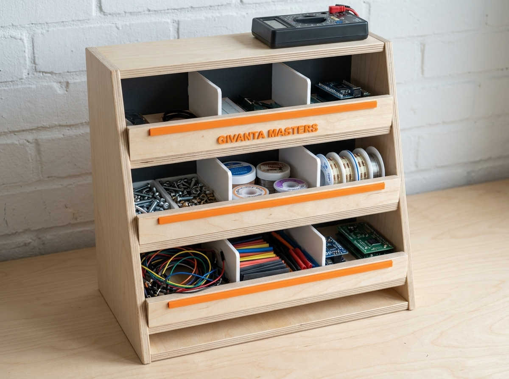

Трёхъярусный настольный минишкафчик с наклонными открытыми лотками: винтики,
флюсы, припой, провода, термоусадка — всё видно и всё на расстоянии пальцев.
Спроектирован в Fusion 360. **Две версии в одном репозитории**: из фанеры
12 мм и полностью печатная на 3D-принтере (детали до 250×250×250 мм).

---

## Кому и зачем

Рабочее место электронщика: паяешь, собираешь макетки, прошиваешь
микроконтроллеры. Каждый ярус наклонён на 12° — содержимое сползает к
переднему бортику, откуда его удобно брать. Перегородки делят ярус на три
отсека: крепёж / химия и припой / провода. Верх — полочка под мультиметр.

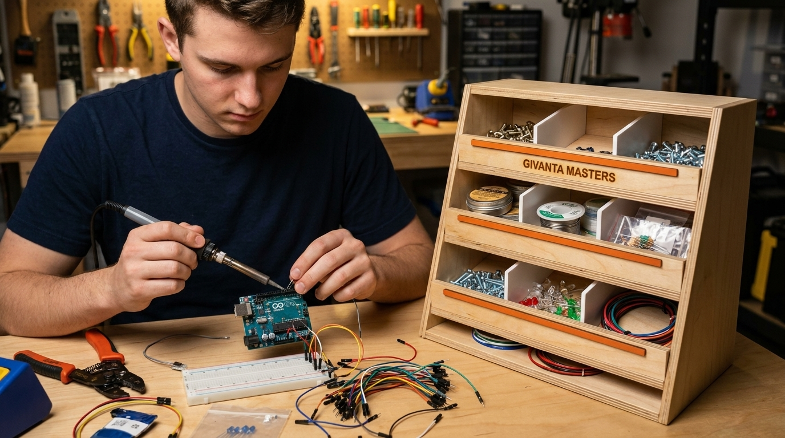

## Версия из фанеры

Габарит 420 × 240 × 390 мм, берёзовая фанера 12 мм + ХДФ 6 мм.

| | |
|---|---|
| 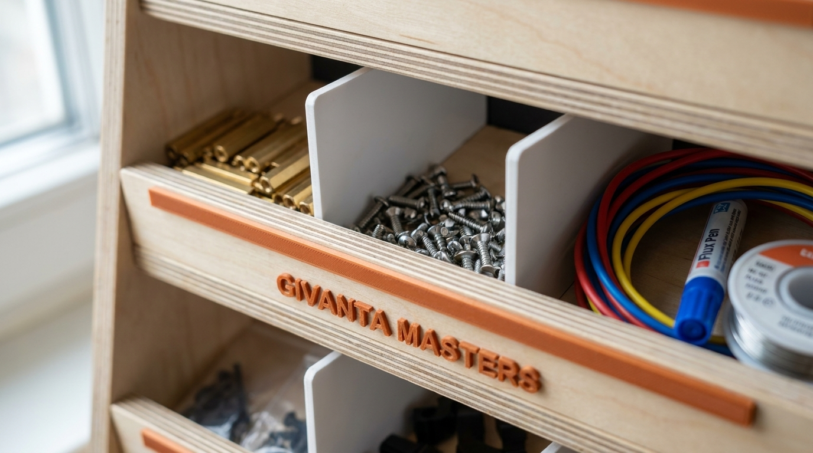 | 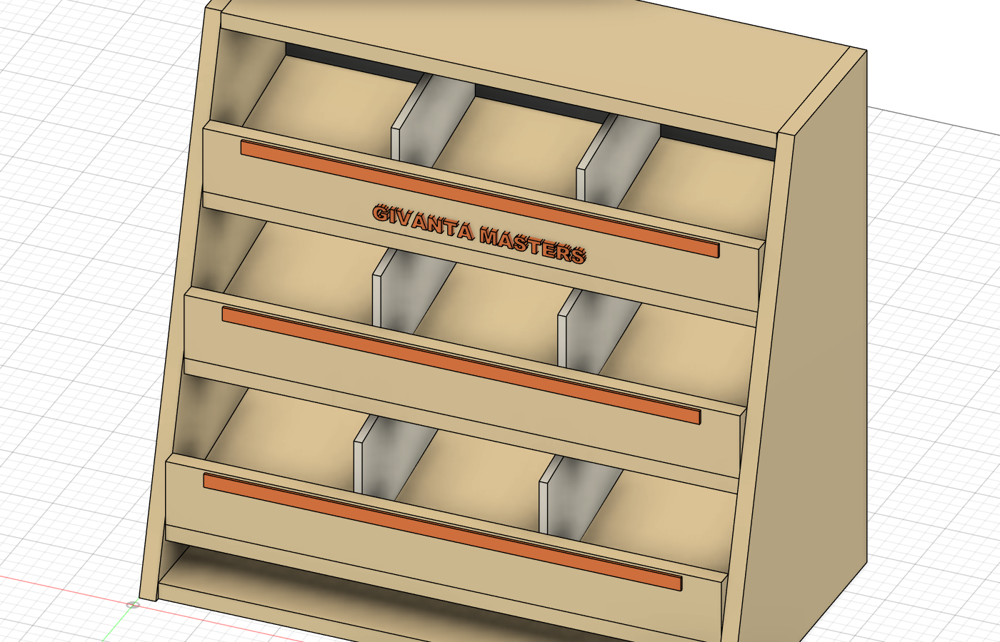 |

- Косые боковины, три наклонных лотка с бортиками 48 мм
- 9 отсеков (перегородки переставные), полочка сверху
- Оранжевые маркировочные планки на бортиках — печать PETG
- Сборка на шканты 6×30 и клей ПВА, ~1 час
- Карта раскроя: [docs/cutlist.csv](docs/cutlist.csv)

**Чертёж** (SVG также в [docs/drawings](docs/drawings)):

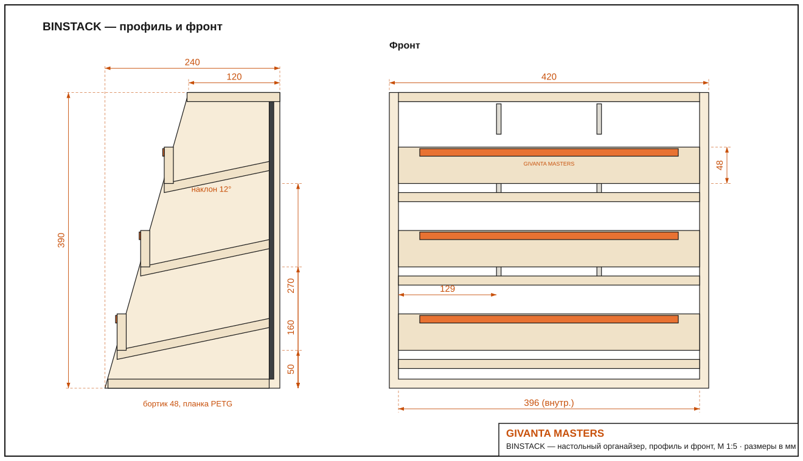

## Печатная версия BINSTACK P

Для тех, у кого есть 3D-принтер и нет циркулярки. Все детали помещаются на
стол 250×250×250, печать **без поддержек**, комплект ~750 г PETG.

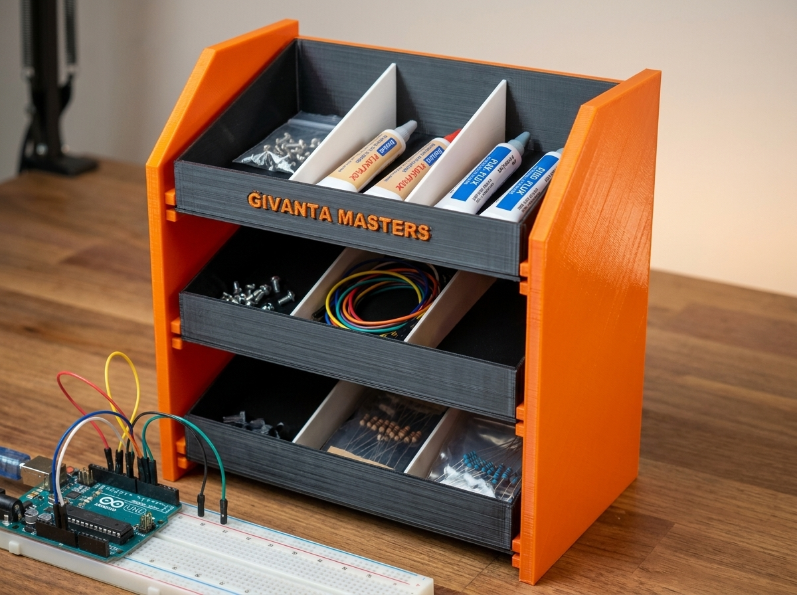

| | |
|---|---|
| 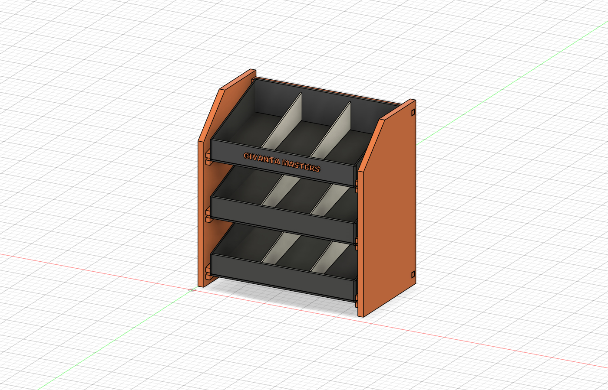 | 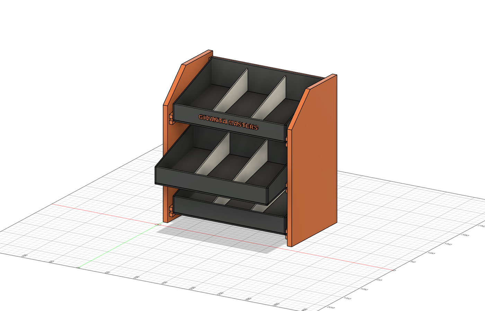 |

Конструкция: две боковины-лесенки с интегрированными полозьями под 12°,
лотки задвигаются как ящики, две штанги стягивают каркас.

**На чём лоток ездит:**
- **Дно лотка шире корпуса на 6 мм с каждой стороны.** Эти выступающие
  фланцы и есть салазки: они лежат в пазу между верхним и нижним полозом
  боковины (перекрытие 5,5 мм). Паз 3,2 мм, дно 2,4 мм — зазор 0,4 на
  сторону по нашей базе печати. Больше в конструкции ничего не требуется:
  ни направляющих, ни метизов.
- Наклон 12° работает на удержание: сам лоток внутрь не сползает, а ход
  назад ограничен задними штангами.

**На чём держатся перегородки:**
На передней и задней стенке лотка напечатаны пары рёбер, образующие
вертикальный паз 3,2 мм. Перегородка (2,4 мм) вставляется в него сверху,
стоит на дне и торцами упирается в стенки: вбок не ездит, не падает,
вынимается вверх пальцами. Пазов **5 на лоток** (шаг 33 мм), так что
перегородки переставляются под размер того, что в них лежит: от одного
широкого отсека до шести узких (перегородки докупать не нужно, просто
напечатать ещё — деталь одна и та же).
- **Детент-упор** — главное, что держит лоток от произвольного выезда. На
  переднем конце каждого нижнего полоза напечатан бугорок 1,0 мм с пологим
  въездом и крутым сходом (люфт паза 0,8 плюс натяг 0,2, поэтому дно
  поджимается и щёлкает, а не просто переезжает ступеньку). Дно лотка перещёлкивается через него с ощутимым
  усилием: закрытый лоток не выедет от тряски стола или толчка, а на выезде
  бугорок ловит лоток, не давая ему выпасть из полозьев целиком.
  Чтобы снять лоток полностью — приподнять перед и протянуть через упор.
- **Движение**: тянешь за передний бортик, щелчок — лоток выехал; толкаешь
  назад до упора в штангу, щелчок — закрыт.

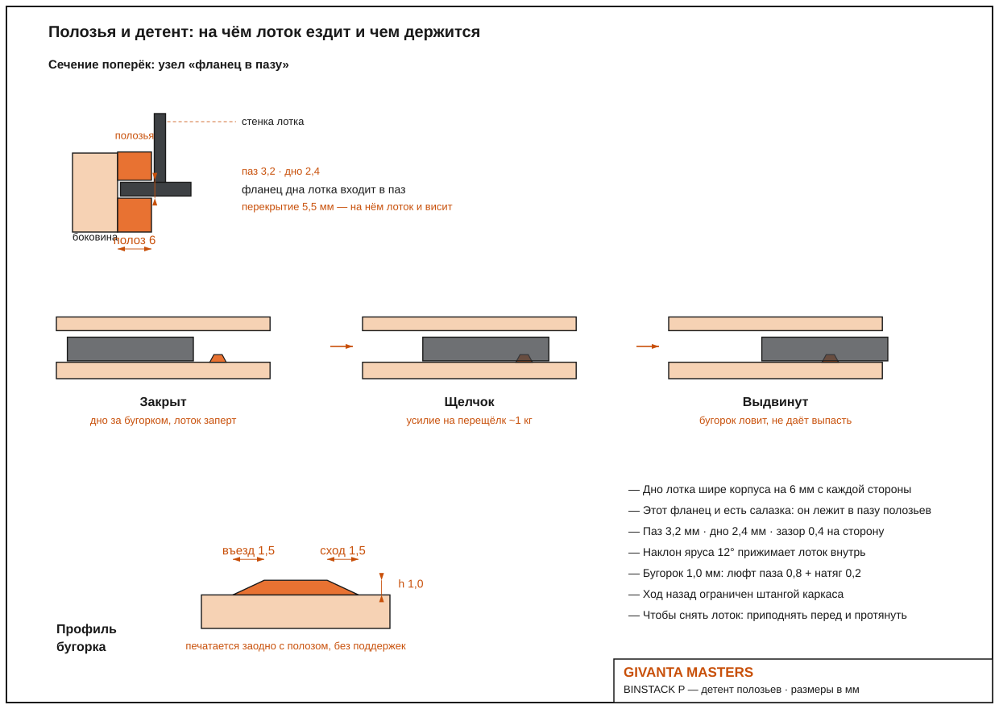
- **Каркас** собирается на сквозные шипы: у каждой штанги на торцах шипы
  6×6×8, они проходят через окна 7×7 в боковинах и выходят заподлицо
  снаружи — столярный узел, никакого клея. При желании фиксируется каплей
  цианакрилата или самореза в торец шипа.

**Раскладка на столе принтера 250×250** — 5 столов на комплект:
боковина (стол целиком, полозьями вверх), боковина зеркальная, и три стола
«лоток + 2 перегородки + штанга» (штанги на первых двух из них):

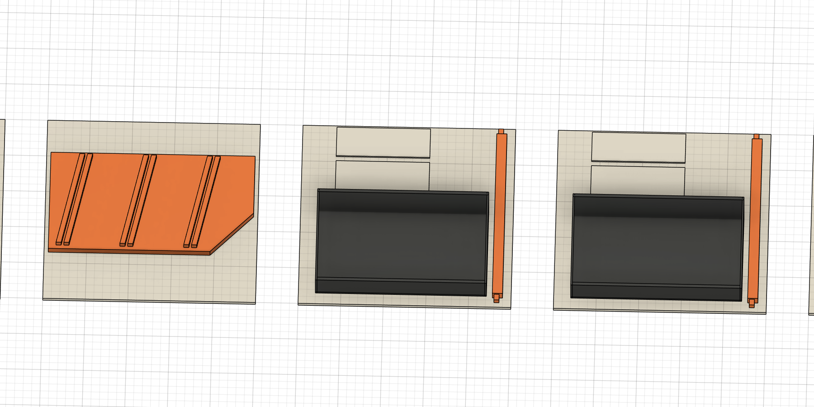

| Файл | Деталь | Кол-во | Ориентация печати |
|---|---|---|---|
| [print/bp-side-panel.stl](print/bp-side-panel.stl) | боковина с полозьями и детентами, 240×150×14 | 2 (одна зеркально) | плашмя, полозьями вверх |
| [print/bp-bin.stl](print/bp-bin.stl) | лоток 213×117×45 (дно с фланцами-салазками) | 3 | дном вниз |
| [print/bp-stretcher.stl](print/bp-stretcher.stl) | штанга с шипами, 222 мм | 2 | лёжа |
| [print/bp-divider.stl](print/bp-divider.stl) | перегородка 109×40×2,4 | 6 (или больше) | плашмя |
| [print/bp-logo-strip.stl](print/bp-logo-strip.stl) | планка с логотипом, 138×17×3 | 1 | лицом вверх |

**Планка логотипа — двухцветная.** Буквы выступают ровно на 0,8 мм над
планкой и лежат выше всей её толщины, поэтому цвет меняется одной паузой:
печатать лицом вверх и поставить смену филамента на высоте **3,0 мм**
(в Creality Print: правый клик по слою → Add color change). Оранжевая
планка, графитовые буквы. Если менять филамент не хочется, деталь
печатается одним цветом и буквы читаются рельефом.

Режим: PETG, сопло 0,4, слой 0,2, заполнение 15 %, стенки 3 периметра.
Посадки: паз полоза 3,2 мм под дно 2,4 (зазор 0,4 на сторону), шипы штанг
6×6 в карманы 7×7. Зеркальную боковину слайсер делает функцией Mirror.

### Тест-кит перед печатью комплекта

Прежде чем печатать боковины целиком, проверь посадку и поведение на наклоне
маленьким китом: 33 минуты и 7,5 г PETG на все четыре купона.

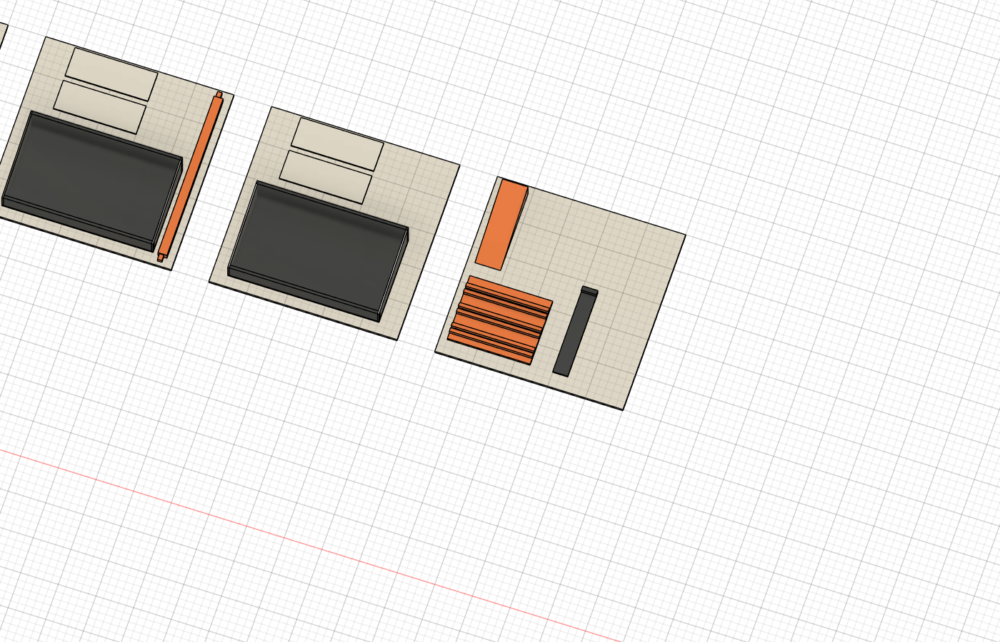

Четыре маленьких купона с **точно теми же припусками**, что в изделии.

| Файл | Что это | Размер |
|---|---|---|
| [print/tk3-rail-coupon.stl](print/tk3-rail-coupon.stl) | кусок боковины: наклонный полоз 12° + детент | 35×26×10, 5 см³ |
| [print/tk3-slider-flange.stl](print/tk3-slider-flange.stl) | кусок дна лотка с фланцем-салазкой | 14×30×10, 2 см³ |
| [print/tk3-divider-slot.stl](print/tk3-divider-slot.stl) | кусок стенки лотка с пазом под перегородку | 24×18×12, 2 см³ |
| [print/tk3-divider.stl](print/tk3-divider.stl) | огрызок перегородки | 18×16×2,4, 1 см³ |

Все четыре купона уже лежат в печатной ориентации: высота набора 12 мм,
48 слоёв, **33 минуты и 7,5 г PETG** на всё (слой 0,25, стенки 2,
заполнение 10 %, без поддержек).

Что проверяем:

1. **Паз перегородки.** Вставь огрызок перегородки в паз купона: должен
   входить пальцем без молотка, но не болтаться. Расчётный люфт 0,8 мм
   (паз 3,2 − перегородка 2,4).
2. **Ход по полозьям.** Поставь купон полоза на торец (полозья тогда идут
   под рабочим наклоном 12°), вставь слайдер фланцем в паз и двигай: ход
   должен быть свободным, без закусывания на стыках слоёв. Перекрытие
   фланца с полозом 5,5 мм.
3. **Детент.** На выезде слайдер должен **щёлкнуть** через бугорок: он
   выше люфта на 0,2 мм, то есть дно поджимается. Задвинутый слайдер не
   должен сам стронуться, если стукнуть по столу.

Если посадка окажется тугой или болтающейся — скажи, какая именно, и все
пазы пересчитываются одним параметром в скрипте.

## CAD

Печатная версия собрана как настоящая сборка: каждая деталь это отдельный
парт с одним телом, сборка состоит из экземпляров этих партов.

| Файл | Что внутри |
|---|---|
| [cad/binstack-print-assembly.f3d](cad/binstack-print-assembly.f3d) | сборка BINSTACK P для Fusion 360: 6 партов, 14 экземпляров |
| [cad/binstack-print-assembly.step](cad/binstack-print-assembly.step) | та же сборка в нейтральном формате |
| [cad/parts/](cad/parts) | каждый парт отдельным файлом: боковины, лоток, перегородка, штанга, планка |
| [cad/binstack-full.step](cad/binstack-full.step) | фанерная версия |

Состав сборки: боковина левая ×1, боковина правая ×1, лоток ×3,
перегородка ×6, штанга ×2, планка логотипа ×1.

## Серия GIVANTA MASTERS

- [WORKSHOP ONE](https://github.com/studygeorge/givanta-workshop-one) — верстак инженера + башня 3D-принтера

## Лицензия

CC BY 4.0 — стройте, печатайте, дорабатывайте. Указывайте авторство:
**GIVANTA MASTERS**.

---

*GIVANTA MASTERS · 2026*
